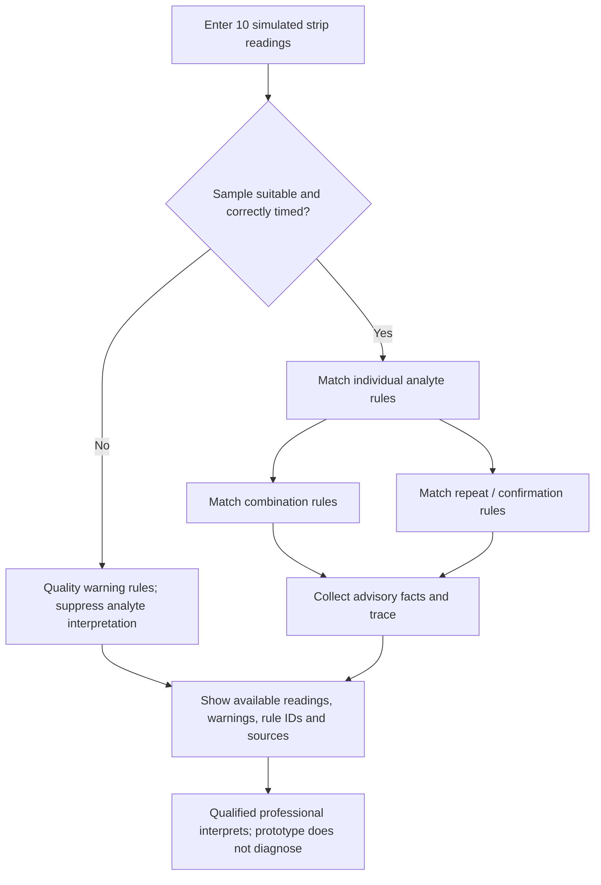

# Decision path / dependency diagram

```mermaid
flowchart TD
 A[Enter 10 simulated strip readings] --> B{Sample suitable and correctly timed?}
 B -- No --> C[Quality warning rules; suppress analyte interpretation]
 B -- Yes --> D[Match individual analyte rules]
 D --> E[Match combination rules]
 D --> F[Match repeat / confirmation rules]
 E --> G[Collect advisory facts and trace]
 F --> G
 C --> H[Show available readings, warnings, rule IDs and sources]
 G --> H
 H --> I[Qualified professional interprets; prototype does not diagnose]
```

The diagram is a simplified view. The engine evaluates all eligible rules in priority order until its working memory reaches a fixed point.
